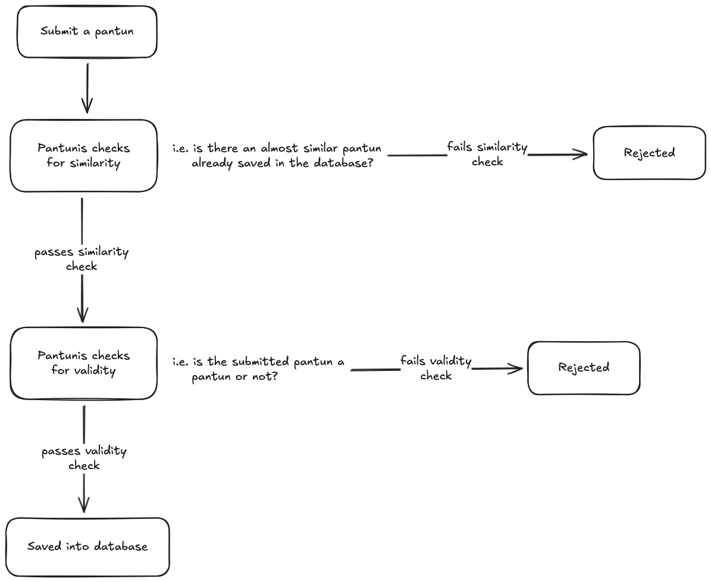

# Pantunis Similarity Check

Subroutines of the Pantunis system that check for similarity between the user submissions and the saved pantuns in the database.



## Cosine Similarity

Checks for meaning between the files.

```zsh
$ python ./cosine_similarity_check.py ./file1.txt ./file1.txt
Cosine Similarity: 1.0000

$ python ./cosine_similarity_check.py ./file1.txt ./file2.txt
Cosine Similarity: 0.3361

# Difference in punctuation (i.e. a comma)
$ python ./cosine_similarity_check.py ./file1.txt ./file1a.txt
Cosine Similarity: 1.0000

$ python ./cosine_similarity_check.py ./love_pantun1.txt ./love_pantun1.txt
Cosine Similarity: 1.0000

$ python ./cosine_similarity_check.py ./love_pantun1.txt ./love_pantun1a.txt
Cosine Similarity: 0.9101
```

## Levenshtein Similarity

Checks for syntactical differences between the files.

```zsh
$ python ./levenshtein_similarity_check.py ./file1.txt ./file1.txt          
Levenshtein Similarity: 1.0000
$ python ./levenshtein_similarity_check.py ./file1.txt ./file2.txt
Levenshtein Similarity: 0.6923
$ python ./levenshtein_similarity_check.py ./file1.txt ./file1a.txt
Levenshtein Similarity: 0.9231
$ python ./levenshtein_similarity_check.py ./love_pantun1.txt ./love_pantun1.txt
Levenshtein Similarity: 1.0000
$ python ./levenshtein_similarity_check.py ./love_pantun1.txt ./love_pantun1a.txt
Levenshtein Similarity: 0.9680
```